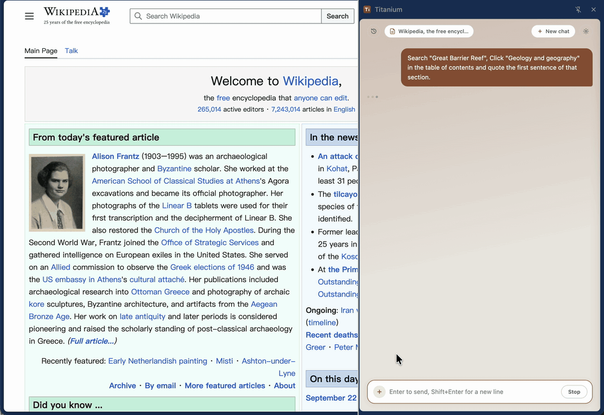

# Titanium — AI Sidebar for the Web

**English** | [中文](README.zh-CN.md)

A Chrome / Edge extension that opens a sidebar on any web page and lets you chat with an AI about it. When you send a message, the extension reads the current page and hands it to the model as context — your own OpenAI-compatible endpoint (DeepSeek, self-hosted Ollama / vLLM, …), your key stays in the browser.



- **Bring your own model** — any OpenAI-compatible endpoint; nothing is sent anywhere else, no analytics
- **Reads the page only when you send** — never on opening the sidebar; page changes are picked up automatically before each message
- **Sees beyond the first screen** — the model can search the page, read the body by position, list interactive elements, highlight one, extract a whole table, or take a screenshot (vision models)
- **Page actions, off by default** — once enabled the AI can click, type, select, press keys, scroll, navigate and manage tabs
- **Redaction before sending** — phone, national ID and bank card numbers are masked (screenshots excepted)
- **Verifiable quotes** — a blockquote gets the "from this page" badge only if it matches the page text verbatim
- **Bilingual, zero dependencies** — English / 简体中文 across UI, prompts and answers; plain HTML/CSS/JS, no build step, no CDN, runs offline

## Quick start

**Install** — download or clone this repository, open `chrome://extensions` (or `edge://extensions`), turn on **Developer mode**, click **Load unpacked** and pick the `extension/` directory. The toolbar icon opens the sidebar.

> Load the **unpacked** directory. A self-packed `.crx` is rejected with `CRX_REQUIRED_PROOF_MISSING` — Chrome only accepts store-signed packages. For organisation-wide rollout use enterprise policy (`ExtensionInstallForcelist`) or an unlisted store listing.

Requires **Chrome 114+** or **Edge 117+** (the `chrome.sidePanel` API). Firefox and Safari have no Manifest V3 side panel and are not supported.

**Configure** — click the gear icon, fill in an endpoint under **Model endpoints**, optionally **Test connection**, then save.

| Setting | DeepSeek official API | Self-hosted (Ollama / vLLM, …) |
|---|---|---|
| Endpoint (baseUrl) | `https://api.deepseek.com/v1` | e.g. `http://localhost:11434/v1` |
| Model name | `deepseek-chat` | whatever you deployed, e.g. `qwen2.5:14b` |
| API key | from the [DeepSeek platform](https://platform.deepseek.com) | empty if the service needs no auth |

> The baseUrl normally ends with `/v1`; the extension appends `/chat/completions`. A 404 on the connection test almost always means this.

- **Several endpoints** — **+** next to "Model endpoints" adds another; the one selected in the dropdown when you save is in use. "Model supports vision" (enables the screenshot tool; screenshots are not redacted) is stored per endpoint.
- **Backup** — uninstalling the extension wipes its storage. **Export settings** writes `titanium-settings.json` with every endpoint and the **API keys in plain text**; **Import settings** restores it. "Allow page actions" is never exported and must be switched on by hand. After a code change use **Reload** on the extensions page — settings survive that.

## Day-to-day use

- **When the page is read** — only when you send a message. Before each message the extension looks at the page again and decides on its own: nothing resent if unchanged, a short "what changed" summary for small changes (paging, expanded sections, AI actions), the full page again only after a URL change or a rewrite. There is no re-read button. The **page chip** at the top left shows what was captured; click it for the URL, counts, and the exact text and outline.
- **Loading pages** — before reading, the extension waits for content to settle and spinners to disappear (about 2.5 s at most). If the page is still loading it reads anyway and tells the model so; the model also has a "wait for page" tool and uses it instead of treating "No data" placeholders as the answer.
- **Tools and long pages** — the model calls perception tools on its own; each call shows as a live step on a light timeline that folds into "Ran N steps" when the answer is in. Only the first 12,000 characters travel with your message; beyond that the model searches, then reads the passage by position. Ask "where is X on this page" and it draws a highlight box for three seconds; ask for "table 2 in full" and you get the whole table. Endpoints without function calling fall back to plain text automatically.
- **Source badge** — a blockquote earns "from this page" only if it matches the captured text verbatim (passages read back by position count too). Treat unbadged quotes with suspicion.
- **History** — every completed turn is saved locally (`chrome.storage.local`, at most 50 conversations or 80% of the storage quota, oldest evicted first; if a conversation cannot be saved, a line in the chat says so). The history button at the top left restores or deletes them; a restored conversation just continues.
- **`/compact`** — once a conversation gets long, type `/compact` (optionally with guidance: `/compact keep the financial figures`) or pick **Compact context** from the **+** menu. Earlier turns collapse into a summary for future requests; what you see on screen stays. Compaction is lossy, and the summary request is about as large as a normal one — **compact early**: once ordinary requests fail on context length, compaction fails too and only **New chat** is left.
- **Boundaries** — browser-internal pages (`chrome://`) and extension stores cannot be read; the chip says so and the AI answers from your question alone. Same-origin iframes (including `srcdoc` and legacy framesets) are read and operated as part of the page; cross-origin frames are not, and the model is told how many there are.
- **Shortcuts** — Enter sends, Shift+Enter breaks a line; **Stop** at any time; hover a reply to copy or regenerate; **New chat** clears everything.

## Skills

A skill is a session-scoped prompt pack — plain instructions, no code — that puts the AI into a task mode. Three ship in this version:

- **Table to CSV** — transcribes a page table in full into a ` ```csv ` block, every figure verbatim; the block copies or downloads as a `.csv` that opens in Excel.
- **Financial statements** — identifies statements and period, shows the formula behind every ratio, and separates page figures from derived ones.
- **Market digest** — explains the market data on the page, never predicts or recommends, and ends every reply with a fixed disclaimer.

Attach one from the **+** menu → **Attach a Skill**, or from the suggestion bar that appears on matching finance sites (quote pages suggest Market digest, disclosure sites suggest Financial statements). The suggestion bar reads only the tab's URL. The active skill sits as a removable chip above the input and lasts for the conversation.

## Page actions (off by default)

Switch on **Allow page actions** in settings or **Page actions** in the **+** menu (same switch; a risk confirmation appears the first time). The AI can then click, fill inputs, pick dropdown options, press keys, scroll, navigate and open or close tabs — "fill this form with the details above", "open that page and summarise it".

- Every action appears as a prominent activity line, and **Stop** skips whatever is pending.
- For irreversible operations — transfers, payments, orders, approval submissions, deletions — the AI explains what it is about to do and waits for your explicit go-ahead. This is a prompt-level guardrail, not a technical block.
- After each action the extension waits for the page to settle (up to 5 s) before reading the result; if it is still loading, the model is told that placeholders are not conclusions and can wait longer.
- While the switch is off, action tools are not registered with the model at all.

**Known limitations** — actions are synthetic events (`isTrusted` is false), which a few strictly validating sites ignore; custom dropdown widgets need the AI to open them and click an option; load detection sees the page, not the network, so a slow backend that shows no loading state can still be read in its empty state ("wait a few seconds and look again" fixes it). Do not enable this on business data you do not want touched.

## How this differs from an in-bank production build

SSO/4A authentication, a domain allowlist, gateway-side redaction and audit logs, per-system extraction adapters, OCR for scanned documents, and audit trails plus step-up authorisation for page actions are all provided by existing in-bank capabilities and are out of scope here.

## Troubleshooting

| Symptom | What to check |
|---|---|
| `CRX_REQUIRED_PROOF_MISSING` on install | Load the unpacked `extension/` directory instead of a self-packed `.crx` |
| Installs, but no sidebar opens | Browser below the version floor (Chrome 114+, Edge 117+) — see `chrome://version` |
| Settings gone after reinstalling | Uninstalling clears extension storage; export before, import after; use **Reload** for code changes |
| 401 | Check the API key |
| 404 | Check that the baseUrl ends with `/v1` |
| Network failure | Endpoint unreachable; make sure a local service is running |
| "does not support tool calling / image input, degraded" | Normal fallback; switch to a model with that capability |
| "Tab switched" | You changed tabs mid-conversation; switch back, or ask again about the current page |
| Clicks / typing have no effect | A few sites ignore synthetic events, or the element numbers are stale — ask the AI to list elements again |

## Contributing and security

- **Contributing** — [CONTRIBUTING.md](CONTRIBUTING.md). Hard constraints first: zero dependencies and no build step, `core/` stays free of `chrome.*`, injected functions stay self-contained, every user- and model-facing string lives in `core/i18n.js` in both languages. `main` is protected — fork and open a PR.
- **Code of conduct** — [CODE_OF_CONDUCT.md](CODE_OF_CONDUCT.md) (Contributor Covenant 2.1).
- **Security** — [SECURITY.md](SECURITY.md); report vulnerabilities through the [Security tab](https://github.com/JialuXu/TitaniumSidebar/security/advisories/new), never in a public issue. It also lists what is *not* a vulnerability: regex best-effort redaction, unredacted screenshots, and the prompt-level guardrail on irreversible actions.
- **Licence** — [MIT](LICENSE).

---

Titanium · Design by Xujl
