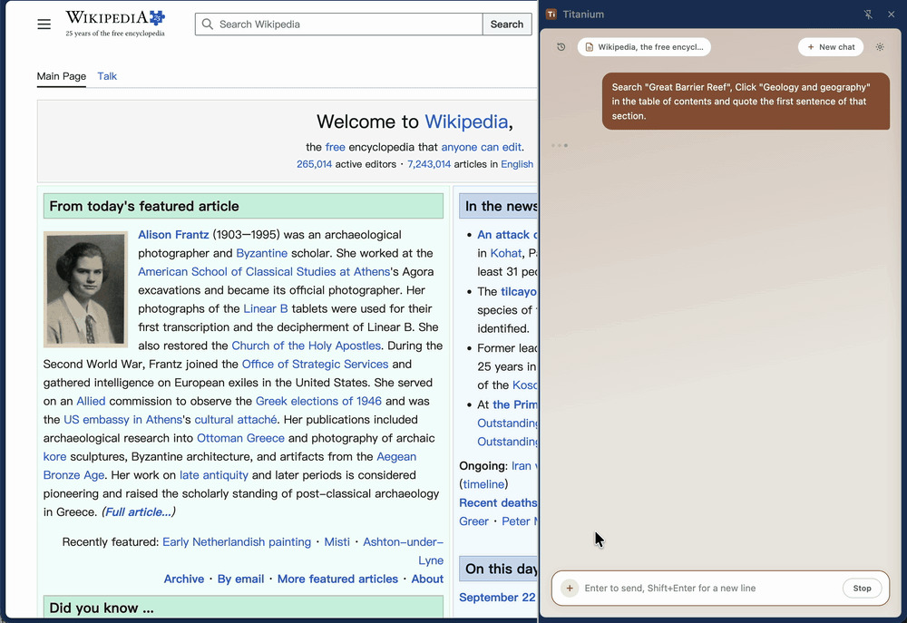

# Titanium

[English](README.md) | **中文**

Titanium 是适用于 Chrome / Edge 的侧边栏扩展，可在任意网页中打开。发送消息时，扩展读取当前网页，并交给**自行配置的**模型，例如 DeepSeek、本地部署的 Ollama 或 vLLM，以及任何 OpenAI 兼容接口。API Key 仅保存在浏览器本地。

## 示例

| 提问 | 行为 |
|---|---|
| 「在当前 GitHub 仓库的 Settings 中，更新 Description，并关闭 Wiki。」 | 进入设置页，修改对应项并保存。每个动作显示在对话中，可随时停止 |
| 「用上一条消息中的内容，填写本页的申请表。」 | 定位表单字段并逐项填写。需先开启页面操作 |
| 「将本页的股票标的整理为表格，并比较估值与近一年表现。」 | 读取页面上的行情与指标，整理后进行比较。引用的数字与页面一致 |

## 安装

1. 克隆本仓库。
2. 打开 `chrome://extensions`（Edge 为 `edge://extensions`），开启**开发者模式**，选择**加载已解压的扩展程序**，指定 `extension/` 目录。
3. 点击工具栏图标。

需要 Chrome 114 及以上，或 Edge 117 及以上。请加载该目录。自行打包的 `.crx` 会被拒绝，并提示 `CRX_REQUIRED_PROOF_MISSING`。组织内批量分发可使用企业策略 `ExtensionInstallForcelist`，或以「不公开」形式发布到扩展商店。

## 配置模型

点击齿轮图标，进入**模型接口**，执行**测试连接**，然后保存。

| | DeepSeek | 本地或自建服务 |
|---|---|---|
| 接口 | `https://api.deepseek.com/v1` | `http://localhost:11434/v1` |
| 模型 | `deepseek-flash`（V4.1-Flash） | `qwen3.8:27b`（Qwen3.8 27B） |
| Key | [DeepSeek 开放平台](https://platform.deepseek.com) | 无需鉴权时可留空 |

接口地址应以 `/v1` 结尾，扩展会在其后拼接 `/chat/completions`。测试连接返回 404 时，通常是地址未以 `/v1` 结尾。

点击 **＋** 可新增一套接口。下拉框中选中的一套为当前使用的接口。「模型支持视觉」（启用截图；截图不经过脱敏）与上下文窗口随每一套接口保存。

卸载扩展前请**导出设置**。文件名为 `titanium-settings.json`，其中的 API Key 为明文。**导入设置**可完整恢复。该文件不包含页面操作开关，此项需单独开启。修改代码后，在扩展管理页点击**重新加载**，已保存的设置会保留。

## 使用说明

- **页面在发送消息时读取。** 内容未变化时不再重复发送。小幅变化（如表格翻页、展开章节）仅发送一段差异摘要。网址变更时重新发送全文。左上角的页面胶囊显示本次读取结果，点击可查看原文。
- **页面仍在加载时**，扩展会先等待约 2.5 秒。若届时仍未稳定，则继续读取，并告知模型。页面上的「加载中」「暂无数据」不作为结论。
- **超出前 12000 字的内容**由模型先搜索，再按位置继续读取。每一步显示为一行，回答完成后折叠为「已执行 N 步」。接口不支持工具调用时，自动降级为纯文本。
- **「来自当前页面」**仅在引用与已读取原文完全一致时显示。按位置读回的段落同样参与核对。
- **手机号、身份证号与银行卡号**在请求发出前脱敏。截图不脱敏。
- **历史会话保存在本机**，上限为 50 段，或存储配额的 80%。超出后优先删除最旧的记录。若某段无法保存，对话中会提示。可通过历史按钮恢复会话并继续。
- **`/compact`** 将此前的对话整理为一份摘要，供后续请求使用。界面上的原文保持不变。可附加说明，例如 `/compact 只保留财报数字`。建议在上下文变长时尽早使用。普通请求已因长度超限而失败时，摘要请求同样会失败，此时只能开始**新对话**。用量约为窗口的 70% 与 85% 时会提醒，**＋** 菜单中可查看当前占比。每套接口可设置**上下文窗口**（如 `128k`；留空时按 64k 估算）。估算以字符数为基础，接口返回 token 用量后自动校准。
- **部分页面无法读取**，包括 `chrome://` 与扩展商店。同源框架（含 `srcdoc` 与旧式 frameset）计入当前页面。跨域框架只记录数量，其内容不进入上下文。
- Enter 发送，Shift+Enter 换行。生成过程中可随时停止。将鼠标悬停在回复上，可复制或重新生成。

## 技能

技能是作用于当前会话的一组指令，不执行代码。打开 **＋** 并选择**绑定 Skill** 即可启用。匹配的财经网站上会出现建议条，该建议仅依据标签页网址。当前技能显示在输入框上方，可随时移除。

- **表格提取（CSV）** — 完整提取表格，数字与页面一致，可下载为 `.csv`
- **财报分析** — 识别报表与报告期，并为每个比率给出计算公式；页面数字与推算数字相互区分
- **行情解读** — 解释页面上的行情数据，不进行预测，每次回复以固定的免责声明结尾

行情页面建议使用「行情解读」。信息披露站点建议使用「财报分析」。

## 页面操作

此项默认关闭。可在设置中开启**允许页面操作**，或在 **＋** 菜单中开启**页面操作**。两处控制同一开关。首次开启时需要确认。

开启后，模型可以点击、输入、选择、按键、滚动、跳转，以及打开或关闭标签页。每个动作在对话中显示为一行。点击**停止**后，尚未执行的动作会被跳过。转账、支付、下单、提交审批与删除会先说明后果，并等待明确同意。这项要求写在提示词中。开关关闭时，模型无法调用这些工具。

每个动作执行后，扩展等待页面稳定，最长 5 秒。

**调试通道**默认关闭。点击、按键与输入通过 `chrome.debugger` 作为真实输入发送，并等待该动作触发的网络请求返回。本轮操作期间，Chrome 会显示「正在调试此浏览器」。若调试器无法附加，或真实点击可能命中其他元素，该步骤改为合成事件，并在结果中说明。

未使用调试通道时，动作为合成事件（`isTrusted` 为 false），少数网站会忽略。是否加载完成只根据页面内容判断，响应较慢时仍可能读到尚未填充的页面。此时可让模型等待后重新查看。自定义下拉组件需先展开，再选择选项。不希望被修改的数据，请保持页面操作关闭。

## 常见问题

| 现象 | 处理办法 |
|---|---|
| `CRX_REQUIRED_PROOF_MISSING` | 加载已解压的 `extension/` 目录。自行打包的 `.crx` 无法安装 |
| 点击图标后侧边栏未打开 | 确认浏览器为 Chrome 114+ 或 Edge 117+，可在 `chrome://version` 查看 |
| 重新安装后设置丢失 | 卸载会清空扩展存储。请在卸载前导出，安装后导入。修改代码时使用**重新加载** |
| 401 | 检查 API Key |
| 404 | 确认接口地址以 `/v1` 结尾 |
| 网络失败 | 接口不可达。请确认本地服务已启动 |
| 已降级：不支持工具调用或图片输入 | 属预期行为。当前模型不具备相应能力 |
| 「标签页已切换」 | 对话过程中更换了标签页。请返回原页面，或针对当前页面重新提问 |
| 点击与输入无响应 | 开启调试通道，或让模型重新列出页面元素 |

## 其他

[贡献指南](CONTRIBUTING.md) · [行为准则](CODE_OF_CONDUCT.md) · [安全策略](SECURITY.md) · [MIT](LICENSE)

参与贡献时请遵守以下约束：零依赖、无构建步骤，`core/` 不调用 `chrome.*`，注入函数保持自包含，面向用户与模型的文案集中在 `core/i18n.js`，并提供中英两种语言。`main` 分支受保护，请先 fork，再提交 PR。

请通过 [Security 标签页](https://github.com/JialuXu/TitaniumSidebar/security/advisories/new) 报告漏洞，不要使用公开 Issue。正则脱敏的覆盖有限、截图不脱敏、不可逆操作仅在提示词中要求确认，这些边界见安全策略。

---

Titanium · Design by Xujl
